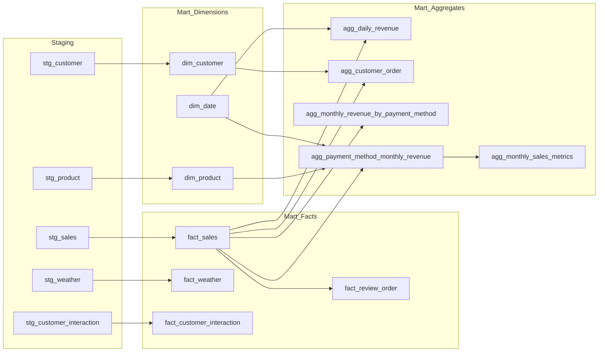
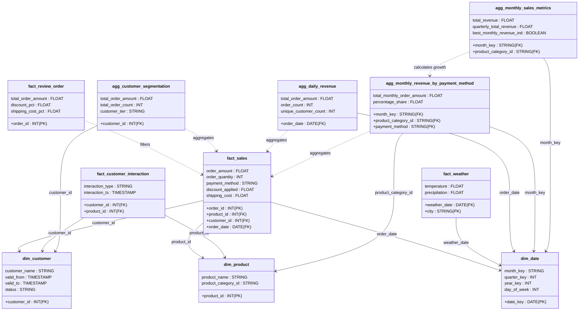

# Model Inventory

### Staging Layer
- **stg_customer**: Profiles and contact information.
- **stg_product**: Core product attributes.
- **stg_product_category**: Categorization and stock levels.
- **stg_sales**: Raw transactional data.
- **stg_subscription**: Plan types and statuses.
- **stg_weather**: Temperature and precipitation data.
- **stg_customer_interaction**: Event-stream data.

### Mart Layer
**Dimensions:** `dim_date`, `dim_customer`, `dim_product`.  
**Facts:** `fact_sales`, `fact_customer_interaction`, `fact_weather`, `fact_review_order`.  
**Aggregates:** `agg_daily_revenue`, `agg_customer_order`, `agg_monthly_revenue_by_payment_method`, `agg_payment_method_monthly_revenue`, `agg_monthly_sales_metrics`.

---

## Model Relationship Summary

Based on the provided SQL and YAML configurations, here is how the core mart models interact:

Sales & Revenue Flow:

fact_sales is the central source for most aggregates.
agg_payment_method_monthly_revenue joins fact_sales with dim_date and dim_product to create a multifaceted view of revenue.
agg_monthly_sales_metrics builds directly on top of the monthly revenue aggregate to calculate window-based metrics like quarterly totals and performance indicators.

Customer Insights:

agg_customer_order performs a RIGHT JOIN between fact_sales and dim_customer to ensure all customers are represented (even those without sales) and classifies them into value tiers.
Data Quality & Review:

fact_review_order acts as a filtered view of fact_sales, flagging records that exceed business logic thresholds for discounts and shipping costs.
Temporal Dimensions:

dim_date is a standalone dimension generated via a recursive range, used by revenue models to provide month_key and quarter_key context.
External Factors:

fact_weather and fact_customer_interaction are currently leaf models in the mart layer, processed from staging but not yet joined into the primary sales aggregates in the provided files.

## Data Flow Diagram

The following diagram illustrates the lineage of data from the staging layer through to the dimensions, facts, and summary aggregates in the mart layer.

## UML

## Data Mapping & Transformations

The following table provides a detailed lineage of the transformations applied to the data as it moves from the staging layer into the final mart models.

+ +{{ read_csv('../docs/mart_layer_column_mapping.csv') }}
