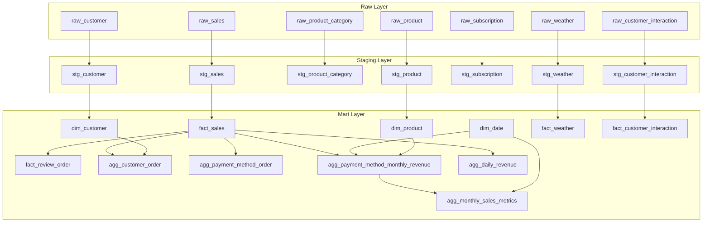

Model Relationship Summary

Based on the provided SQL and YAML configurations, here is how the core mart models interact:

Sales & Revenue Flow:

fact_sales is the central source for most aggregates.
agg_payment_method_monthly_revenue joins fact_sales with dim_date and dim_product to create a multifaceted view of revenue.
agg_monthly_sales_metrics builds directly on top of the monthly revenue aggregate to calculate window-based metrics like quarterly totals and performance indicators.
Customer Insights:

agg_customer_order performs a RIGHT JOIN between fact_sales and dim_customer to ensure all customers are represented (even those without sales) and classifies them into value tiers.
Data Quality & Review:

fact_review_order acts as a filtered view of fact_sales, flagging records that exceed business logic thresholds for discounts and shipping costs.
Temporal Dimensions:

dim_date is a standalone dimension generated via a recursive range, used by revenue models to provide month_key and quarter_key context.
External Factors:

fact_weather and fact_customer_interaction are currently leaf models in the mart layer, processed from staging but not yet joined into the primary sales aggregates in the provided files.

+## Data Mapping & Transformations + +The following table provides a detailed lineage of the transformations applied to the data as it moves from the staging layer into the final mart models. + +{{ read_csv('../docs/mart_layer_column_mapping.csv') }}

